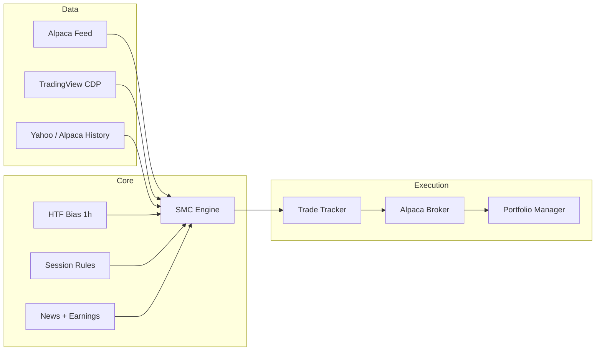

# SMC Trading Agent

A Node.js / TypeScript intraday trading agent that scans US equities using **Smart Money Concepts (SMC)** — order blocks, fair value gaps, liquidity sweeps, and market structure — then executes **paper trades** on [Alpaca](https://alpaca.markets/).

The agent runs continuously during market hours, evaluates every ticker on your watchlist, and only fires when multiple confluence factors align. It manages entries, stops, scaled take-profits, and end-of-day flattening automatically.

## Features

- **SMC engine** — swing detection, BOS/MSS structure breaks, order blocks, FVGs, liquidity sweeps, volume confirmation, and confluence scoring
- **Dual data feeds** — Alpaca batch polling (default) or TradingView Desktop via CDP (legacy)
- **Alpaca paper execution** — bracket orders in RTH, limit orders in extended hours
- **Session-aware trading** — respects pre-market, prime RTH windows, lunch chop, and EOD force-flat
- **HTF/LTF bias alignment** — 1h higher-timeframe bias filters 15m setups
- **News & earnings gates** — headline sentiment and earnings blackout windows
- **Sharia-compliant mode** — long-only, no shorting (optional)
- **Aggressive vs conservative modes** — tune signal frequency vs quality
- **Portfolio sync** — Alpaca positions auto-sync every 30s; optional `portfolio.json` for SL/TP overrides
- **Live diagnostics** — heartbeat + per-ticker scanner status shows why each symbol isn't trading

## Architecture



## Prerequisites

- **Node.js 20+**
- **Alpaca paper account** — [sign up free](https://app.alpaca.markets/signup)
- *(Optional)* **TradingView Desktop** with remote debugging, only if using `DATA_SOURCE=tradingview`

## Quick start

```bash
# 1. Install dependencies
npm install

# 2. Configure environment
cp .env.example .env
# Edit .env — add your Alpaca paper keys at minimum

# 3. Run in development mode
npm run dev

# Or build and run production
npm run build
npm start
```

On startup the agent will:

1. Print Alpaca account status and sync any open positions
2. Backfill 300 historical bars per ticker
3. Prime 1h HTF bias for each symbol
4. Start the live feed and scan every tick through the SMC pipeline
5. Emit a heartbeat every 5 minutes with trade stats and scanner diagnostics

## Configuration

All runtime settings live in `.env`. See [`.env.example`](.env.example) for the full list with comments.

| Variable | Default | Description |
|---|---|---|
| `DATA_SOURCE` | `alpaca` | `alpaca` (recommended) or `tradingview` |
| `TICKERS` | `NVDA,MU,INTC` | Comma-separated watchlist |
| `TIMEFRAME` | `15m` | LTF chart interval |
| `MIN_CONFIDENCE` | `70` | Minimum confluence score (0–100) to fire a setup |
| `AGGRESSIVE` | `false` | Loosen filters for more frequent signals |
| `SHARIA_COMPLIANT` | `true` | Long-only mode — blocks all shorts |
| `ALPACA_AUTO_TRADE` | `false` | `true` submits orders; `false` dry-run only |
| `ENABLE_OVERNIGHT` | `false` | Alpaca 24/5 overnight session |
| `MAX_TRADES_PER_DAY` | `5` | Daily trade cap |
| `MAX_CONCURRENT` | `2` | Max simultaneous open positions |

### Alpaca feed (recommended)

Set `DATA_SOURCE=alpaca` and provide `ALPACA_PAPER_KEY_ID` / `ALPACA_PAPER_SECRET_KEY`. The agent polls all watchlist tickers in parallel — no TradingView required.

### TradingView CDP (legacy)

Set `DATA_SOURCE=tradingview` and launch TradingView Desktop with remote debugging:

```powershell
& "C:\Program Files\TradingView\TradingView.exe" --remote-debugging-port=9222
```

The scraper reads the **currently visible chart tab** only. Flip through each symbol on TradingView to get live ticks for your full watchlist.

## Trading modes

### Conservative (default)

- HTF and LTF bias must align
- Requires a recent **MSS** (market structure shift), not just BOS
- Requires a recent liquidity sweep
- Requires volume/momentum confirmation
- Respects lunch, open-volatility, and close-auction stand-down windows

### Aggressive (`AGGRESSIVE=true`)

- Wider recency window (50 vs 20 bars)
- Accepts BOS continuations, not just MSS reversals
- Liquidity sweep and volume are bonuses, not hard gates
- Trades through lunch and open/close windows (still respects weekends and EOD force-flat)

### Sharia-compliant (`SHARIA_COMPLIANT=true`)

Long-only spot trading. Bearish signals are skipped — the agent waits for a bullish reversal rather than shorting. Shorts are blocked at both the signal and broker layers.

## Session schedule (US Eastern)

| Window | Time (ET) | New entries |
|---|---|---|
| Pre-market | 04:00 – 09:30 | Yes (limit orders) |
| RTH open vol | 09:30 – 10:00 | No (conservative) |
| Prime RTH | 10:00 – 11:30 | Yes (bracket orders) |
| Lunch | 11:30 – 13:00 | No (conservative) |
| Prime RTH | 13:00 – 15:30 | Yes |
| Close auction | 15:30 – 15:50 | No new entries |
| Force flat | 15:50 – 16:00 | Closes all positions |
| Post-market | 16:00 – 20:00 | Yes (limit orders) |
| Overnight | 20:00 – 03:50 | Yes if `ENABLE_OVERNIGHT=true` |

## Project structure

```
src/
  index.ts            Orchestrator — feed, analysis loop, heartbeat
  smc-engine.ts       SMC detection and confluence scoring
  risk-manager.ts     Entry zone, stop-loss, take-profits, sizing
  trade-tracker.ts    WATCHING → ENTERED → CLOSED state machine
  alpaca-broker.ts    Alpaca SDK wrapper
  alpaca-feed.ts      Multi-ticker Alpaca live feed
  alpaca-history.ts   Historical bar backfill via Alpaca
  portfolio.ts        Position sync and SL/TP management
  session-rules.ts    Time-of-day trading windows
  bias.ts             1h HTF bias cache
  news.ts             Alpaca News API sentiment gate
  fundamentals.ts     Earnings calendar gate
  scraper.ts          TradingView CDP scraper (legacy)
  market-data.ts      Yahoo Finance backfill fallback
  types.ts            Shared TypeScript interfaces
  logger.ts           Winston file + chalk console logging
```

## Scripts

| Command | Description |
|---|---|
| `npm run dev` | Run with ts-node (development) |
| `npm run build` | Compile TypeScript to `dist/` |
| `npm start` | Run compiled `dist/index.js` |
| `npm run watch` | TypeScript watch mode |

### Smoke tests

```bash
npx ts-node src/test-alpaca.ts        # Alpaca order round-trip
npx ts-node src/test-alpaca-data.ts    # Alpaca data feed check
```

## Logs

Runtime logs are written to `./logs/` (configurable via `LOG_DIR`):

- `setups.log` — every qualified setup (even if not traded)
- `error.log` — errors and exceptions

Console output includes heartbeats, trade actions, and a per-ticker scanner status showing the current block reason for each symbol.

## Portfolio file

`portfolio.json` is **optional** and gitignored. Alpaca is the source of truth for open positions. Use the file only to override stop-loss and take-profit levels for specific tickers:

```json
{
  "positions": [
    {
      "ticker": "NVDA",
      "side": "long",
      "qty": 10,
      "entry": 120.00,
      "stopLoss": 115.00,
      "takeProfits": [
        { "price": 125.00, "label": "TP1", "rr": 1.0 },
        { "price": 130.00, "label": "TP2", "rr": 2.0 }
      ]
    }
  ]
}
```

If omitted, defaults from `DEFAULT_STOP_PCT`, `DEFAULT_TP1_PCT`, and `DEFAULT_TP2_PCT` are applied to adopted Alpaca positions.

## Disclaimer

This software is for **educational and paper-trading purposes only**. It is not financial advice. Past performance of any strategy does not guarantee future results. Always test thoroughly in paper mode before considering live capital. The authors are not responsible for any trading losses.
